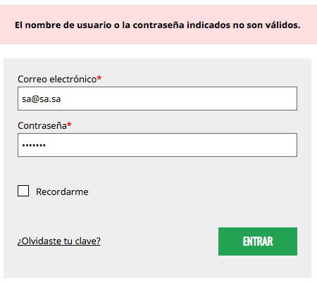
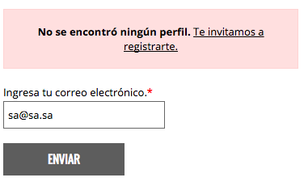
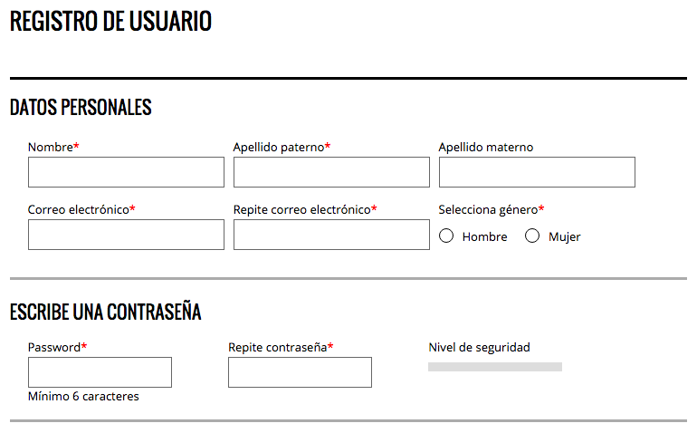
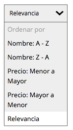
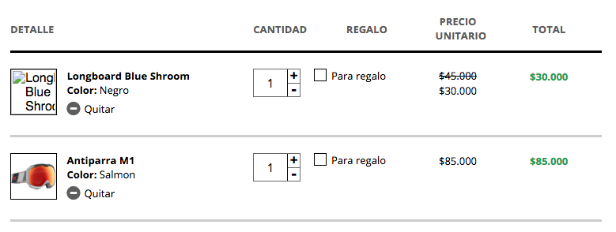

Guía de nomenclatura para tests unitarios
=====

La siguiente guía tiene el fin de normalizar la creación y definición de nombres de ID's para componentes y elementos para proyectos de e-commerce en I2B Technologies y los tests unitarios que se deban hacer una vez creadas las funcionalidades. 

Se apoya en la [Guía para el Código Frontend](README.md) y en [MutableCSS](mutable-css.md) para su concepción e implementación.

---

**Patrón base:** 

Para todo componente (funcionalidad individual y que contiene un conjunto de elementos):
- lowerCamelCased
- en inglés
- la primera palabra en minúscula y singular y representa la función del componente
- la segunda palabra `Box`

Ej: `loginBox`, `registerBox`, `cartBox`, `filterBox`

Para todo elemento (elementos indivisibles que tienen función específica dentro de su componente):
- lowercase
- en inglés
- sin espacios
- la primera palabra hereda la funcionalidad del componente en que reside
- la segunda palabra la acción del elemento
- la tercera corresponde a su selector ó tipo de elemento

Ej: `loginsubmitbutton`, `recoveryerrormessage`

---

## Login
```
#loginBox
    #loginusernameinput
    #loginpasswordinput
    #loginsubmitbutton
    #logincancelbutton
    #loginerrormessage
```



## Olvidaste tu clave
```
#recoveryBox
    #recoveryemailinput
    #recoverysubmitbutton
    #recoverycancelbutton
    #recoveryerrormessage
```



## Registro
```
#registerBox
    #registerfirstnameinput
    #registerlastnameinput
    #registerpasswordinput
    #registerrepeatpasswordinput
    #registertermsconditionscheckbox
    #registersubmitbutton
    #registercancelbutton
    #registererrormessage
```



## Carro de Compras

```
#cartBox
    #cartemptybutton
    #cartpaybutton
```


## Buscador
```
#searchBox
    #searchtextinput
    #searchsubmitbutton
```


## Paginador
```
#paginationBox
```

## Cupón descuento
```
#couponBox
    #couponcodeinput
    #couponsubmitbutton
```


## Filtros


### Precio
```
#filterPriceBox
    #pricemininput
    #pricemaxinput
```

### Marca
```
#filterBrandBox
```

### Color
```
#filterColorBox
```

### Cantidad Productos 
```
#productsquantityselect
```


### Ordenamiento Productos
```
#productsorderselect
```



## Productos

Para todo contenedor individual de producto, se tomará como sufijo identificador único a la nomenclatura el [SKU] del producto (UPPERCASED).

### Resumen de producto

Para toda página que contenga una lista de productos, el formato debe contemplar el siguiente patrón de componente:

```
#productBox[SKU]
```

![productBox[SKU]](images/productBox[SKU].png)

### Ficha de producto

```
#productSingleBox
    #productbuybutton
    #productaddtocartbutton
    #productzoombutton
```


### Checkout

```
#checkoutBox
    #checkoutproductbox[SKU]
```



### Envío

```
#shippingCheckoutBox
    #shippingcheckout[option]
```


### Resumen de compra

```
#checkoutResumeBox
```

### Método de pago

```
#paymentCheckoutBox
	#paymentcheckout[option]
```

### Confirmar compra

```
#paymentConfirmBox
	#paymentconfirmbutton
	#paymentcancelbutton
```

### Compra exitosa

```
#paymentSuccessBox
```

### Compra rechazada

```
#paymentRejectBox
```
